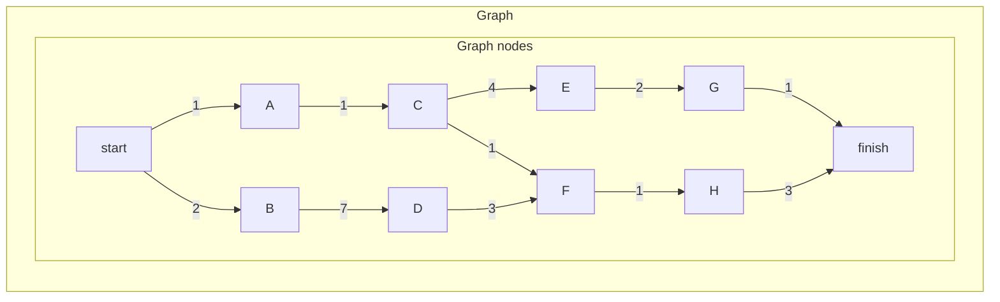

```mermaid
flowchart LR
    subgraph Graph
        subgraph Graph nodes
        start
        A
        B
        C
        D
        E
        F
        G
        H
        finish
        start --> |1| A --> |1| C --> |4| E --> |2| G --> |1| finish
        start --> |2| B --> |7| D --> |3| F --> |1| H --> |3| finish
        C --> |1| F
        end
    end
```
