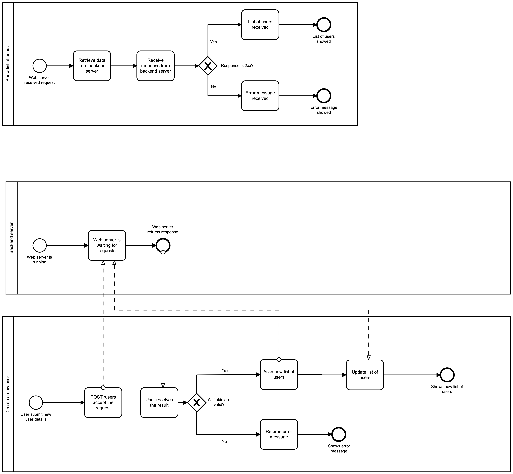

## Get list of users

1. User tries to access `users.html`If the web server doesn't work, 404 Error code will appear
3. If web server works fine, page will send `GET /users`
4. If Response code is `2xx`, backend API will return list of users
5. If response code is `4xx or 5xx`, error message will appear on the screen.

## Create new user

1. User will fill required inputs
2. When Create button clicks, `form.submit()` event will trigger
3. It will send `POST /users` request to backend
4. validate() function will be called
5. If fields are not correct, error message will return -- `message.error()`
6. IF success message works, it means user was created.
7. We will try to update list of Users
8. If `GET /users` works, UI will update(updateUI()) and message.success() will be called
9. If `GET /users` not works, message.error() will be called

